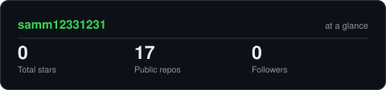
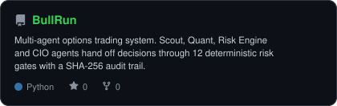
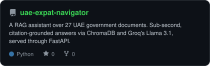
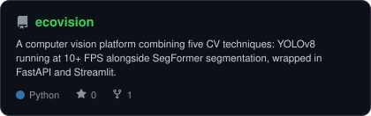
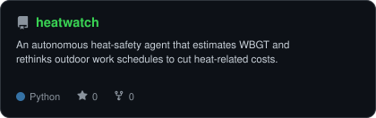

<div align="center">

<!-- PORTRAIT - to add your photo, drop a headshot as assets/me.png and run:
     python scripts/dotify.py assets/me.png -o assets/portrait --cols 100 --equalize --detail 0.5 --color
     Then uncomment the line below. Cut yourself out of the background first (PNG with transparency) for best results. -->
<!--  -->

<br>

<!-- NAME / TAGLINE - animated typing -->
<a href="https://github.com/samm12331231">
  
</a>

<br>

<!-- SOCIALS -->
<a href="https://linkedin.com/in/samyukth-kalathil-b17234274"></a>
<a href="mailto:pksam234@gmail.com"></a>
<a href="https://github.com/samm12331231?tab=repositories"></a>


</div>

---

## `~/` whoami

```console
$ cat about.txt
```

Hi, I'm **Samyukth Kalathil**. I'm a Computer Science student (majoring in Big Data & AI)
building the kind of AI systems I want to learn from — RAG pipelines that cite their sources,
multi-agent systems with real guardrails, and computer-vision tools that run fast on cheap hardware.

- Currently building **[UAE Expat Navigator](https://github.com/samm12331231/uae-expat-navigator)** and **[BullRun](https://github.com/samm12331231/BullRun)**
- Interning at **FlyRank** as an AI/ML Engineer
- Learning **production LLM systems & LoRA fine-tuning**
- Fun fact: **I benchmarked a RAG system on an AMD MI300X — and it still runs faster than the websites it answers questions about.**

<br>

<div align="center">

## `~/` toolbox


</div>

---

<div align="center">

## `~/` skill radar

<table>
<tr>
<td width="50%" align="center" valign="middle">

<!-- Self-rated radar - edit assets/skills.json, the workflow redraws it -->
<picture>
  <source media="(prefers-color-scheme: dark)"  srcset="assets/radar-dark.svg">
  <source media="(prefers-color-scheme: light)" srcset="assets/radar-light.svg">
  
</picture>

</td>
<td width="50%" align="center" valign="middle">

<!-- Live radar built from real language byte counts across your repos -->
<picture>
  <source media="(prefers-color-scheme: dark)"  srcset="assets/radar-langs-dark.svg">
  <source media="(prefers-color-scheme: light)" srcset="assets/radar-langs-light.svg">
  
</picture>

</td>
</tr>
</table>

</div>

---

<div align="center">

## `~/` contribution calendar

<!-- 3D isometric calendar, regenerated every 6h by .github/workflows/metrics.yml -->


<br><br>

<!-- Snake eats the contribution graph - .github/workflows/snake.yml -->
<picture>
  <source media="(prefers-color-scheme: dark)"  srcset="https://raw.githubusercontent.com/samm12331231/samm12331231/output/snake-dark.svg">
  <source media="(prefers-color-scheme: light)" srcset="https://raw.githubusercontent.com/samm12331231/samm12331231/output/snake.svg">
  
</picture>

</div>

---

<div align="center">

## `~/` the numbers

<!-- Generated by scripts/cards.py into this repo. Deliberately NOT
     github-readme-stats / streak-stats / github-profile-trophy: those are
     shared public instances that go down and take the whole section with them. -->
<picture>
  <source media="(prefers-color-scheme: dark)"  srcset="assets/card-stats-dark.svg">
  <source media="(prefers-color-scheme: light)" srcset="assets/card-stats-light.svg">
  
</picture>

<br>


<br><br>


</div>

---

<div align="center">

## `~/` selected work

<!-- Cards generated by scripts/cards.py from assets/projects.json.
     Stars, forks and language are pulled live from the API on every run. -->
<table>
<tr>
<td width="50%">
  <a href="https://github.com/samm12331231/BullRun">
    <picture>
      <source media="(prefers-color-scheme: dark)"  srcset="assets/card-BullRun-dark.svg">
      <source media="(prefers-color-scheme: light)" srcset="assets/card-BullRun-light.svg">
      
    </picture>
  </a>
</td>
<td width="50%">
  <a href="https://github.com/samm12331231/uae-expat-navigator">
    <picture>
      <source media="(prefers-color-scheme: dark)"  srcset="assets/card-uae-expat-navigator-dark.svg">
      <source media="(prefers-color-scheme: light)" srcset="assets/card-uae-expat-navigator-light.svg">
      
    </picture>
  </a>
</td>
</tr>
<tr>
<td width="50%">
  <a href="https://github.com/samm12331231/ecovision">
    <picture>
      <source media="(prefers-color-scheme: dark)"  srcset="assets/card-ecovision-dark.svg">
      <source media="(prefers-color-scheme: light)" srcset="assets/card-ecovision-light.svg">
      
    </picture>
  </a>
</td>
<td width="50%">
  <a href="https://github.com/samm12331231/heatwatch">
    <picture>
      <source media="(prefers-color-scheme: dark)"  srcset="assets/card-heatwatch-dark.svg">
      <source media="(prefers-color-scheme: light)" srcset="assets/card-heatwatch-light.svg">
      
    </picture>
  </a>
</td>
</tr>
</table>

<sub>

| project | stack |
|---|---|
| **[BullRun](https://github.com/samm12331231/BullRun)** | `Python` `LangChain` `Next.js` |
| **[uae-expat-navigator](https://github.com/samm12331231/uae-expat-navigator)** | `Python` `LangChain` `ChromaDB` `FastAPI` |
| **[ecovision](https://github.com/samm12331231/ecovision)** | `Python` `PyTorch` `YOLOv8` `FastAPI` |
| **[heatwatch](https://github.com/samm12331231/heatwatch)** | `Python` |

</sub>

</div>

---

<div align="center">

<sub>`01100010 01110101 01101001 01101100 01100100 00100000 01110011 01101111 01101101 01100101 01110100 01101000 01101001 01101110 01100111 00100000 01110111 01101111 01110010 01110100 01101000 00100000 01101100 01101111 01101111 01101011 01101001 01101110 01100111`</sub>

</div>
